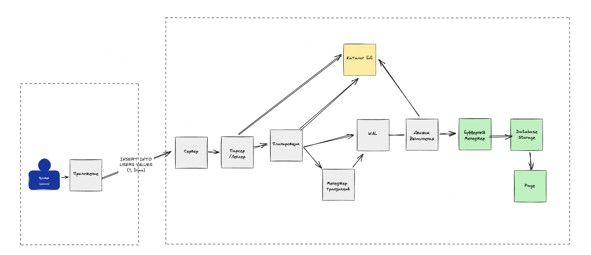

# GopherDB

Lightweight Postgres-inspired DB (HSE Data Engineering '28).

## Схема запроса в СУБД

<p align="center">
  
</p>

## Поддерживаемые операции

- `CREATE TABLE`
- `INSERT INTO`
- `SELECT (включая WHERE)`
- `CREATE INDEX (HASH, BTREE)`
- `EXPLAIN`

## Поддерживаемые типы данных

- `INT64`
- `VARCHAR`

## Примеры запросов

```sql
-- Создание таблицы
CREATE TABLE students (id INT64, name VARCHAR);
-- Вставка данных
INSERT INTO students VALUES (1, 'ramazan');
INSERT INTO students VALUES (2, 'max');
-- Разные примеры выборки данных
SELECT * FROM students;
SELECT * FROM students WHERE id = 1;
SELECT * FROM students WHERE name = 'max';
-- Создание индекса и его использование
CREATE INDEX idx_students_id ON students (id) USING BTREE;
CREATE INDEX idx_students_name ON students (name) USING HASH;
-- Использование анализа выполнения запроса
EXPLAIN SELECT * FROM students; -- SeqScan
EXPLAIN SELECT * FROM students WHERE id = 1; -- BTreeIndexScan
EXPLAIN SELECT * FROM students WHERE name = 'max'; -- HashIndexScan
```

## Как запустить Server/CLI

Проект является монорепозиторием, содержащим два основных компонента: `Server` и `CLI`. Для запуска каждого из них
выполните
следующие шаги:

### Запуск сервера

1. Перейдите в директорию сервера:

```bash
cd cmd/server
```

2. Соберите и запустите сервер:

```bash
go build -o gopherdb-server
./gopherdb-server -port=<порт> -dataDir=<директория_для_данных> -poolSize=<размер_пула>
```

### Запуск CLI

1. Перейдите в директорию CLI:

```bash
cd cmd/cli
```

2. Соберите и запустите CLI:

```bash
go build -o gopherdb-cli
./gopherdb-cli -host=<адрес_сервера> -port=<порт> -trace=<true|false>
```

